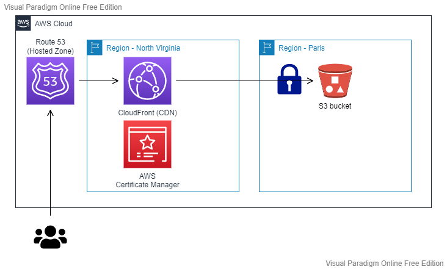

# Deploy your Hugo website on AWS with Terraform 

This project is aim to deploy the infrastructure needed by [Hugo](https://gohugo.io/) on [AWS](https://aws.amazon.com/).
This infrastructure force the usage of HTTPS with a specific domain name.

## Prerequisites

You need to have:
1. Have a domain name (for HTTPS).
2. Have a certificate (for HTTPS).

### Setting up the domain name

Our Terraform does not create the hosted zone (because it depends on where your domain name is located).
> The hosted zone is not required. It is possible to not use Amazon Route 53 for [configuring Amazon CloudFront](https://docs.aws.amazon.com/AmazonCloudFront/latest/DeveloperGuide/CNAMEs.html)
and [to create the certificate](https://docs.aws.amazon.com/acm/latest/userguide/gs-acm-request-public.html). The action will require more effort and manual action.

**TO DO**: [Create the public hosted zone on Amazon Route 53](https://docs.aws.amazon.com/Route53/latest/DeveloperGuide/migrate-dns-domain-in-use.html)

### Setting up the certificate

In our case, our Terraform does not create the certificate because it takes a little time to issuing it, which can fail our Terraform execution, so we will have to create the certificate manually.

**To do**: [Create the public certificate on ACM in N. Virginia (us-east-1)](https://docs.aws.amazon.com/acm/latest/userguide/gs-acm-request-public.html)

## Solution architecture



The Terraform deploys:
- A **S3 bucket**: this S3 bucket will contain our static website.
The content thereof is private and accessible only by CloudFront via an [Origin Access Identity (OAI)](https://docs.aws.amazon.com/AmazonCloudFront/latest/DeveloperGuide/private-content-restricting-access-to-s3.html).
In other words, our users will have to go through Amazon CloudFront and not directly on Amazon S3 to access to our website.
- A **CloudFront distribution**: will allow us to use HTTPS on our website, to use a custom domain name, to set up a
[Content Delivery Network (CDN)](https://aws.amazon.com/cloudfront/) and
enhance security through the [AWS Shield service](https://aws.amazon.com/shield).
- A **Route 53 record**: a new Alias will be created for our CloudFront distribution
- A **CloudFront function**: is used to rewrite URL to append `index.html` to the end if not exist.  


## How is it working ?

Before starting, you need to check if:
- You have created `the public hosted zone on Amazon Route 53`
- You have created `the public certificate on ACM in N. Virginia (us-east-1)`

If so, you can now be able to deploy your infrastructure.

### Deployment

Add a `terraform.tfvars` file with the following variables and values:
- `bucket_name` : is the s3 bucket that will be created
- `dns_name` : will be the domain name used via Route 53

> Also, create `backend.tf` file with your own Terraform backend configuration if needed.

Once the GIT repository is ready, run your commands (check your AWS credentials beforehand):
```bash
$ terraform init
$ terraform plan
$ terraform apply
```

### Cleanup

To destroy this project use the following command:
```bash
$ terraform destroy
```

After that, don't forget to remove:
- the `AWS Certificate Manager (ACM)` certificate
- the `public hosted zone` on Amazon Route 53

## Contact

You see something wrong ? You want extra information or more ?

Contact me: 3exr269ch@mozmail.com